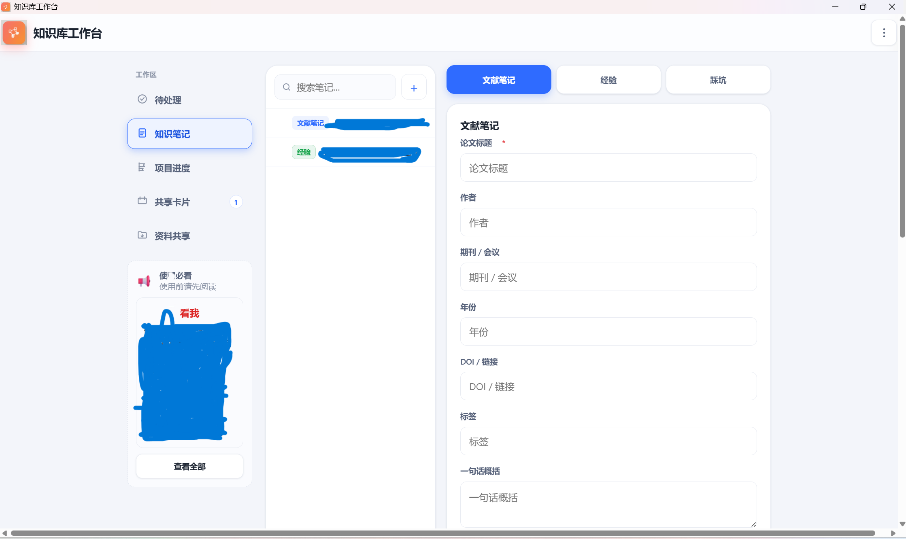
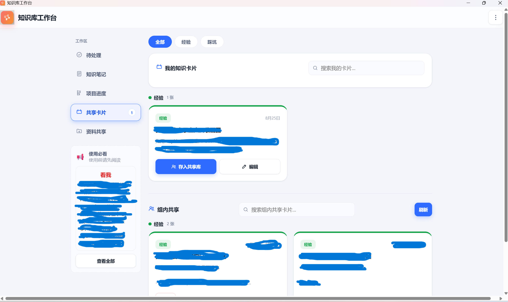
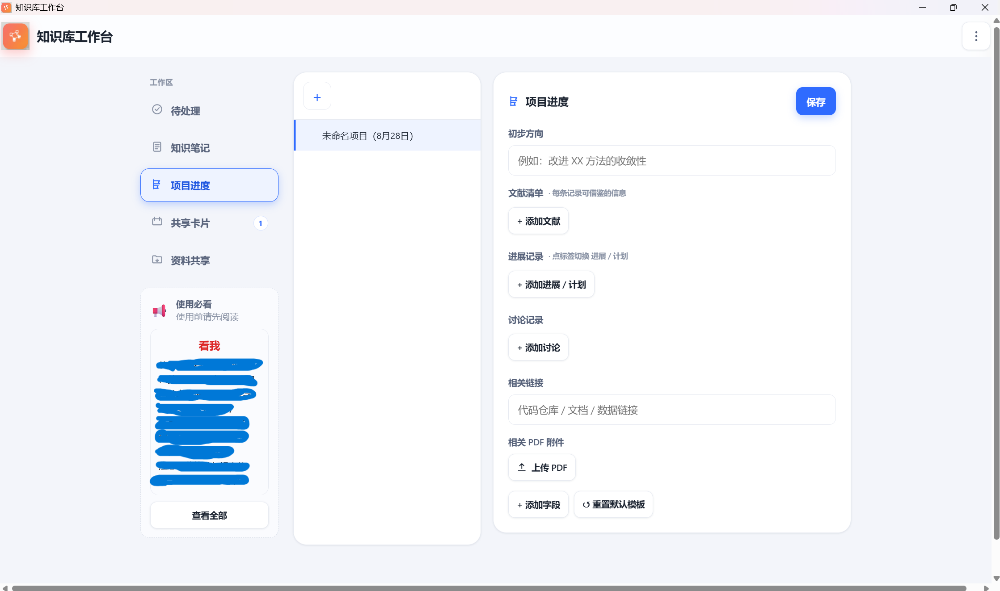
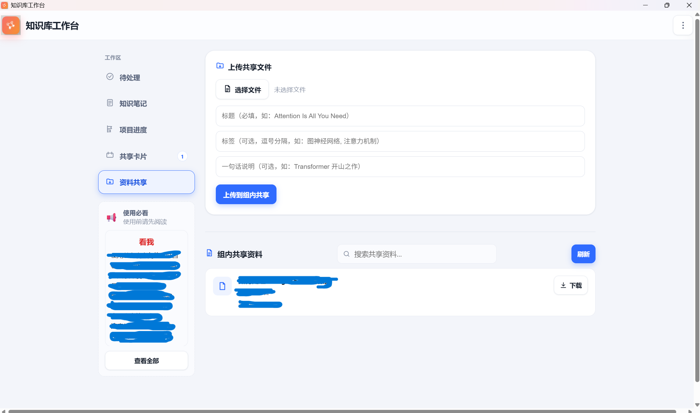
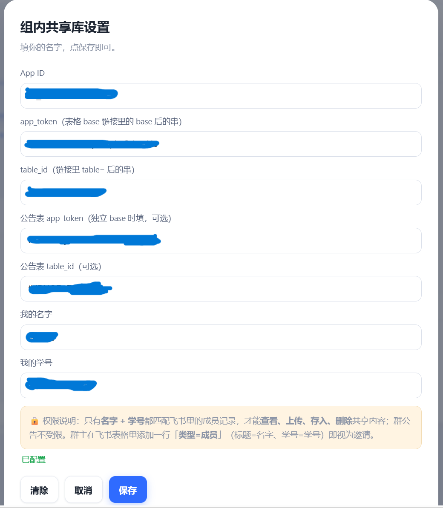
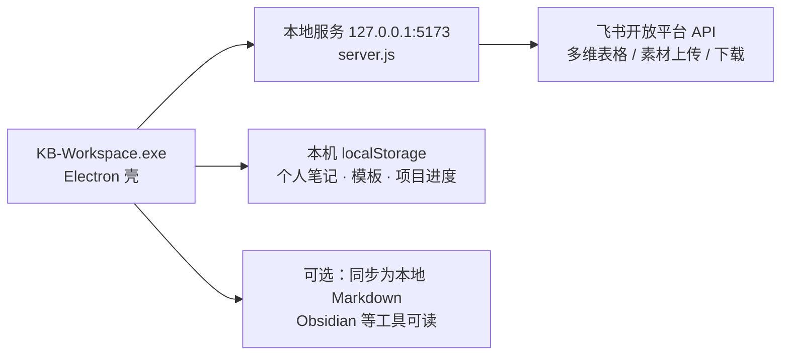

# KB-Workspace · 组内知识库工作台

> 给没有服务器、没有预算的研究生课题组用的知识库 —— 个人笔记留在本地，共享内容一键发飞书。

一个真实的故事：一个 10 人左右的理论物理课题组，导师和组员的资料散落在 arXiv PDF、教材、手写笔记、Markdown、Word 里。没有服务器，没有预算，也折腾不起部署。我们想做一套知识库，让每个人愿意记、愿意分享。

于是有了 KB-Workspace：**一个本地优先的桌面应用，个人数据存在自己的电脑里，共享内容通过飞书多维表格协作，零服务器、零成本**。

它不是一个「文档平台」，而是一套**沉淀经验与踩坑**的工作台 —— 我们的核心场景是：读文献、记经验、写踩坑，然后一键把值得分享的内容同步给全组。

对新人来说，每一张知识卡片不只是答案，更是**自己前进的标志**——每沉淀一张，都在对抗"别人都会、我不会"的焦虑；而每个新人最终都会成为"老人"，把同样的经验再传给下一个人。这个循环一旦转起来，课题组就拥有了自己的「活文档」。

---

## ✨ 特性

- **🎓 为课题组而生**：内置文献笔记 / 经验 / 踩坑三类模板（可自由编辑），还有项目进度跟踪。新人进组，照着模板写就行。
- **🔒 Local-first**：笔记、项目进度、模板全部存在本机（localStorage + 可选同步为 Markdown 文件），不上传任何个人数据。数据主权在自己手里。
- **📡 飞书当轻后端**：不买服务器，用免费的飞书多维表格 API 做组内共享。分享=复制成卡片存入飞书表，人人可写、人人可看。免费空间对课题组规模绰绰有余，真的满了，换一张新表、改一个 token 即可继续。
- **🧩 完整设计思路**：从方案文档、笔记模板到代码全套公开。你可以只抄思路，也可以直接跑起来。
- **👥 成员白名单**：名字 + 学号软校验，防止共享内容被组外人员读写。
- **🖼️ 图文笔记**：支持粘贴/上传图片、多步骤图文条目，分享到飞书时图文自动还原。
- **📦 打包即用**：Electron 单文件应用，Windows 双击即用（源码版可自行打包）。

---

## 📸 界面预览

| | |
|---|---|
|  |  |
|  |  |
|  | |

五个模块：知识笔记（文献/经验/踩坑模板）、知识卡片（生成分享卡片）、项目进度（本地私有）、资料共享（组内文件）、共享库设置（飞书接入与成员白名单）。

## 🏗️ 架构



- **前端**：单文件 `index.html`（原生 JS，无构建步骤），五个模块：待处理 / 知识笔记 / 项目进度 / 知识卡片 / 资料共享。
- **本地服务**：`server.js` 是唯一接触飞书 API 的地方，App Secret 只存在于后端，前端永远拿不到密钥。
- **Electron 壳**：`main.js` + `preload.js` 提供本地文件读写 IPC（保存 Markdown 到任意文件夹、扫描已有 .md 笔记）。

## 🚀 快速开始

```bash
# 1. 安装依赖（需要 Node.js 16+）
npm install

# 2. 启动
npm start
```

> 也可以直接用浏览器打开 `index.html`，但共享库功能依赖本地服务，建议通过 Electron 运行。

### 接入飞书（约 5 分钟，共享库功能可选）

共享库依赖你自己的飞书应用，参照 `feishu.config.example.json` 配置：

1. 到 [飞书开放平台](https://open.feishu.cn/app) 创建**企业自建应用**，记下 App ID / App Secret。
2. 复制 `feishu.config.example.json` 为 `feishu.config.json`，填入上面两个值。
3. 在飞书多维表格建一张共享表，表里填上成员名单（类型=成员，标题=名字，学号=学号）。
4. 启动应用，点右上角「⋯ → 组内共享库设置」，填入 App ID、app_token、table_id 和你的名字/学号。
5. 共享页即可看到全组卡片，写好的经验/踩坑点「存入组内共享」即发布。

> 更详细的建库流程见 [`docs/组内知识库建设方案.md`](docs/组内知识库建设方案.md)。

## 📁 目录结构

```
├── index.html              # 前端全部逻辑（单文件，无构建）
├── server.js               # 本地代理服务：飞书 API 转发 / 静态文件 / 安全防护
├── main.js                 # Electron 主进程：窗口 + 本地文件 IPC
├── preload.js              # 渲染进程桥（window.kbAPI）
├── feishu.config.example.json  # 飞书凭证配置示例（真实凭证放 feishu.config.json，勿提交）
└── docs/                   # 完整方案文档 + 笔记模板
    ├── 组内知识库建设方案.md
    ├── 新人指南.md
    ├── 经验贴模板.md / 踩坑贴模板.md
    └── 个人库模板/          # 文献笔记 / 经验 / 踩坑 三套模板
```

## 💡 设计思路（值得参考的点）

- **「想分享就写飞书，不想分享就写本地」**：不要求双份维护，分享是在本地笔记基础上的一键动作，而不是另起炉灶。
- **复用一张多维表格**：经验、踩坑、资料、公告、成员名单都放在同一张表里，用「类型」字段区分，减少建表成本（飞书 App 无建表权限也能跑）。
- **图片用占位符往返**：本地 base64 图片分享时上传为飞书素材，正文用 `@@IMG<n>@@` 占位，展示时再替换回图文内联，避免表格正文塞爆。
- **密钥只进后端**：App Secret 只存在于 `server.js`，前端即使被部署到公网也泄露不了密钥；本地服务还做了 Origin 白名单，防止其他网页借道调用。
- **性能兜底**：250ms 防抖渲染 + 图片懒加载 + 预览区占位，单文件应用在低配电脑上也不卡。

## 📝 License

[MIT](LICENSE) © 2026 KB-Workspace contributors

